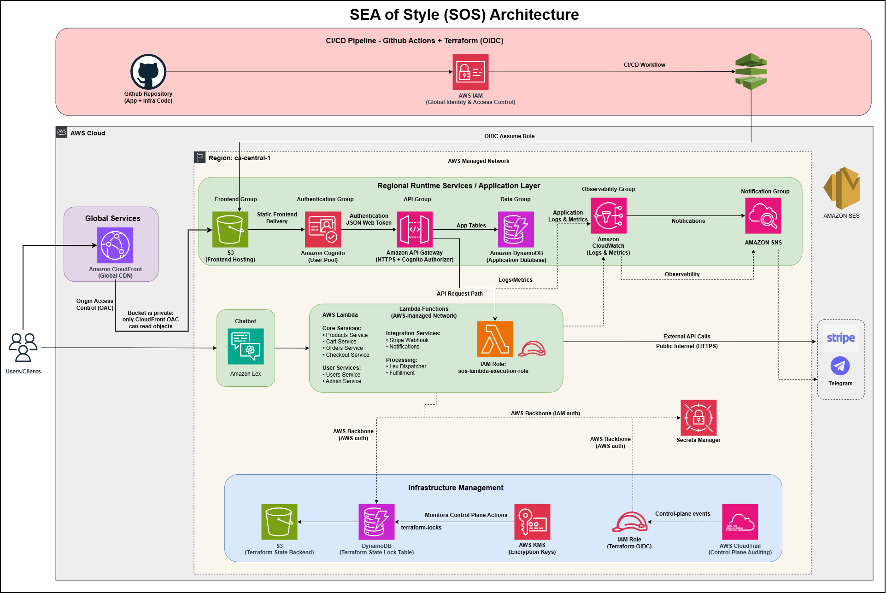
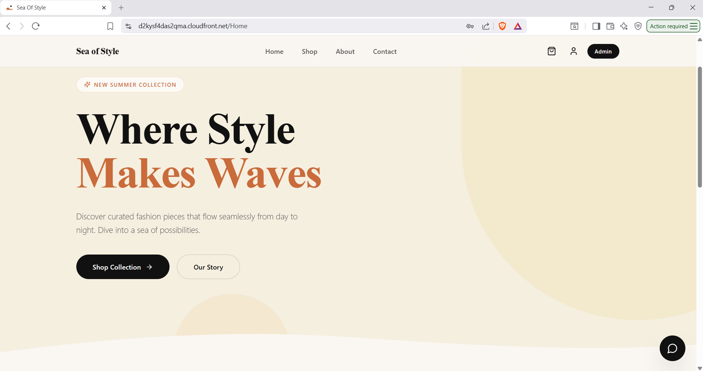
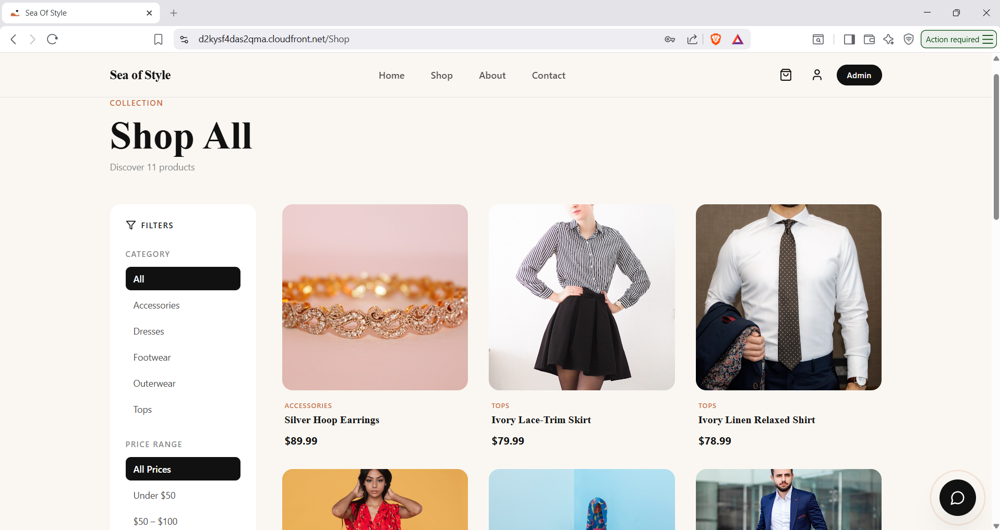
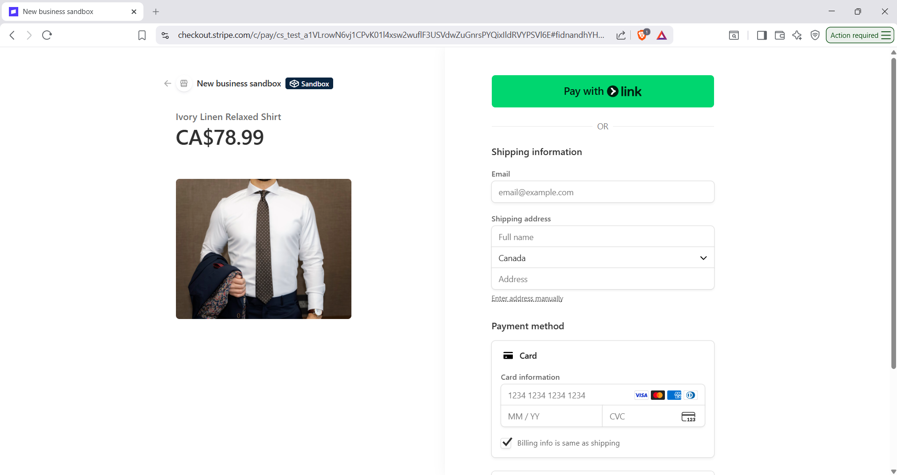
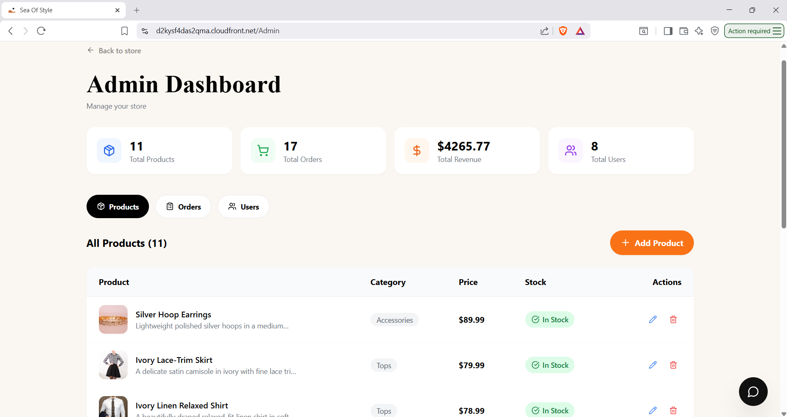
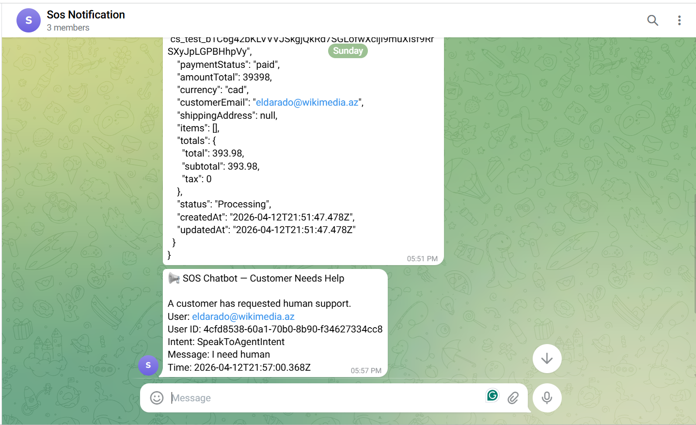
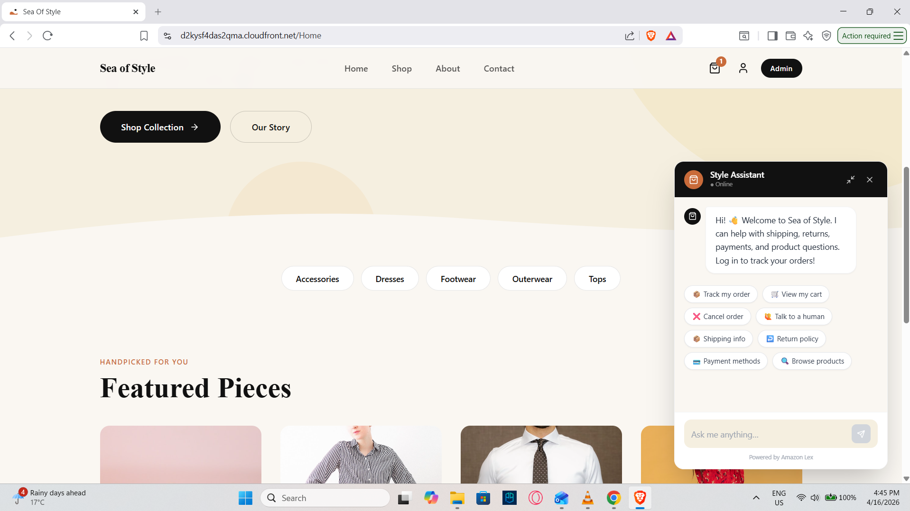

# SEA of Style (SOS) — Secure Cloud-Based E-Commerce Platform

> A serverless, cloud-native e-commerce platform built on AWS — featuring full authentication, real-time notifications, AI chatbot, CI/CD automation, and Infrastructure as Code.

**Seneca College · CAA900NCE Capstone · Group 8 · April 2026**

---

## 👥 Team

| Name | Role |
|------|------|
| Shirish Anand Joshi | Infrastructure Engineer |
| Eldar Azimov | Lead DevOps Engineer |
| Amir Bhandari | Cloud Solutions Architect |

---

## 📌 What is SOS?

SOS (Sea of Style) is a production-ready, fully serverless e-commerce platform where users can browse fashion products, create accounts, place orders, and track purchases — while admins manage inventory, users, and order statuses in real time.

The platform is deployed on **AWS** using a microservices architecture with zero traditional server management.

---

## 🏗️ Architecture Overview



We follow a hybrid deployment strategy: initially provisioning services manually for rapid prototyping, followed by full automation using Terraform and GitHub Actions for production-grade scalability**.

---

## ✨ Key Features

### 🛍️ Customer Experience
- Browse products by category and price range
- Secure signup with email verification (Cognito)
- Add to cart, checkout with **Stripe** payment
- Order history and real-time order status
- AI-powered **chatbot** (Amazon Lex) for support queries
- Secure password reset via email

### 🔧 Admin Dashboard
- Add, edit, delete products
- Manage user roles (promote users to admin)
- Update order statuses: Processing → Confirmed → Shipped → Delivered / Cancelled
- Real-time order alerts via **Telegram bot**

### 🔒 Security & DevOps
- JWT-based auth via Amazon Cognito
- Least-privilege IAM roles per service
- Secrets managed by AWS Secrets Manager + KMS encryption
- Full audit trail via AWS CloudTrail
- CI/CD with GitHub Actions + OIDC (no stored credentials)
- Terraform IaC with S3 state backend + DynamoDB state locking

---

## 🖼️ Screenshots

### Home Page


### Shop Page — Product Catalogue


### Checkout with Stripe


### Admin Dashboard


### Telegram Admin Notification


### Amazon Lex Chatbot


> 📁 All screenshots are in `/docs/screenshots/`

---

## 🛠️ AWS Services Used

| Category | Services |
|----------|----------|
| Frontend | Amazon S3, Amazon CloudFront |
| Auth | Amazon Cognito |
| API & Compute | Amazon API Gateway, AWS Lambda (Node.js 20.x) |
| Database | Amazon DynamoDB |
| Notifications | Amazon SNS, Amazon SES, Telegram Bot |
| AI/ML | Amazon Lex (Chatbot) |
| Payments | Stripe (Webhook integration) |
| Security | AWS IAM, AWS KMS, AWS Secrets Manager |
| Monitoring | Amazon CloudWatch, AWS CloudTrail |
| DevOps | Terraform, GitHub Actions (CI/CD + OIDC) |

---

## 💵 Estimated Monthly Cost

~**$20–$45 USD/month** for 1,000–2,000 users, using a fully serverless pay-as-you-use model. Several services (Cognito, CloudTrail, SES) operate within AWS Free Tier limits.

---

## 📐 AWS Well-Architected Framework

| Pillar | Implementation |
|--------|---------------|
| Operational Excellence | CloudWatch monitoring, GitHub Actions CI/CD, Telegram alerts |
| Security | Cognito auth, IAM least-privilege, KMS encryption, CloudTrail |
| Reliability | Lambda multi-AZ, DynamoDB replication, CloudFront caching |
| Performance Efficiency | Serverless auto-scaling, CloudFront edge delivery |
| Cost Optimization | Pay-per-use pricing, no idle infrastructure |
| Sustainability | Event-driven architecture, no always-on servers |

---

## 🚀 Infrastructure Deployment (Terraform)

```bash
# Initialize
terraform init

# Preview changes
terraform plan

# Apply
terraform apply
```

> CI/CD via GitHub Actions handles plan + apply automatically on PR merge. No AWS Console access required.

---

## 📁 Project Structure

```
/
├── frontend/          # Static HTML/CSS/JS (deployed to S3)
├── backend/           # Lambda function handlers (Node.js)
│   ├── products/
│   ├── cart/
│   ├── orders/
│   ├── users/
│   ├── admin/
│   ├── checkout/
│   ├── notifications/
│   └── stripe-webhook/
├── terraform/         # IaC modules
│   ├── api-gateway/
│   ├── cloudfront/
│   ├── cognito/
│   ├── dynamodb/
│   ├── iam/
│   ├── lambda/
│   ├── monitoring/
│   ├── notifications/
│   ├── s3/
│   └── secrets/
├── .github/workflows/ # GitHub Actions CI/CD
└── docs/screenshots/  # Project screenshots
```

---

## 📄 License

Academic project — Seneca College, School of Information and Communications Technology.
